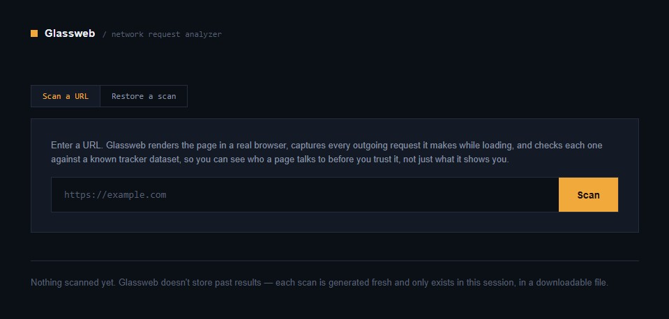
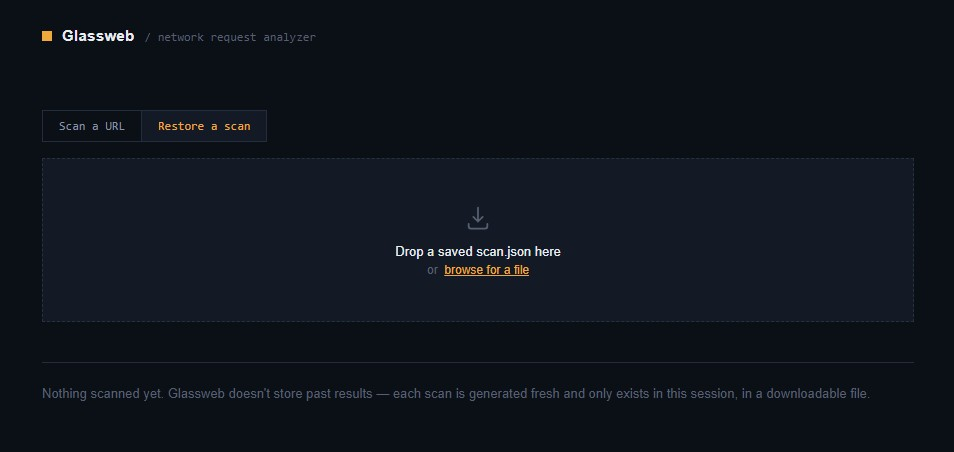
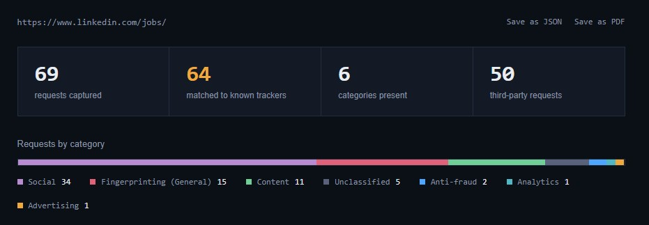
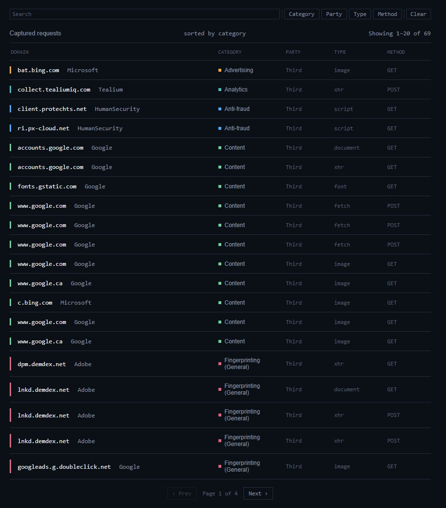
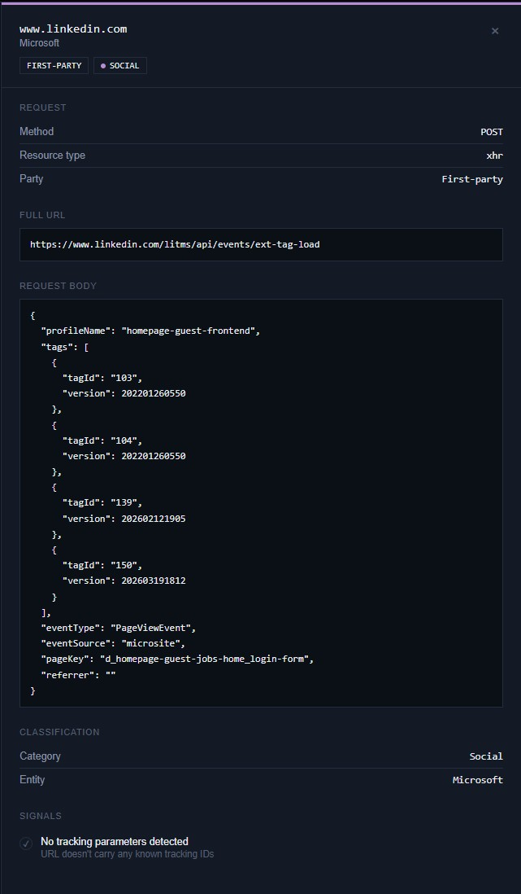
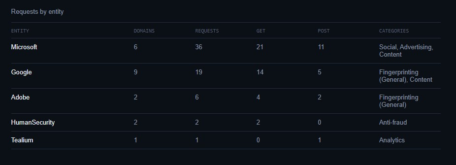

# Glassweb

A containerized network request analyzer that launches a headless Chromium browser to audit outgoing traffic against a known tracker database.


---

## Key Features

* **Headless Traffic Auditing:** Spawns an isolated Chromium instance via Playwright to intercept and inspect real-time network requests.
* **Tracker Classification:** Matches outgoing request domains against the Disconnect.me dataset to categorize trackers (Analytics, Advertising, Social, etc.).
* **Interactive Dashboard:** Nginx-hosted UI featuring request detail inspection, tracker category breakdowns, client-side JSON export, and scan restoration.
* **PDF Report Generation:** Server-side PDF export built using Playwright's headless rendering pipeline.
* **Resource-Bounded Containers:** Docker Compose setup capped at 1GB RAM to ensure deterministic resource handling.

---

## Interface Overview

### 1. Search & Scan Restoration
Supports live URL scanning or analysis by restoring pre-saved JSON scan files.<br><br>



### 2. Scan Metrics & Summary
Displays overview stats.<br><br>


### 3. Network Request Analysis
Displays captured outgoing network requests. Clicking any request row opens a detail panel showing more information about the request.<br><br>



### 4. Trackers & Entity Breakdown
Categorizes network requests by tracking entity (e.g., Google, Meta).<br><br>


---

## Tech Stack

* **Backend:** Python, FastAPI, Playwright (Chromium), Uvicorn
* **Frontend:** JavaScript (ES6+), HTML5, CSS3, Nginx
* **DevOps:** Docker, Docker Compose

---

## How to Run It

### Prerequisites

* [Docker Desktop](https://www.docker.com/products/docker-desktop/) installed and running.

### Launching the App
```bash
   git clone https://github.com/emiHuy/glassweb.git
   cd glassweb
   docker compose up --build
```

Access the web interfact at http://localhost:8080.

## API Documentation

| Endpoint | Method | Parameters / Body | Description | Response |
| :--- | :--- | :--- | :--- | :--- |
| `/health` | `GET` | *None* | Basic health check for service availability. | `{"ok": true}` |
| `/test-render` | `GET` | *None* | Verifies Playwright & Chromium are operational in-container. | `{"title": "..."}` |
| `/scan` | `GET` | `url` *(query, required)* | Navigates to target URL, intercepts traffic, and classifies trackers. | `JSON` scan results |
| `/export/pdf` | `POST` | Scan payload *(JSON body)* | Builds a print-friendly HTML report and renders a downloadable PDF. | `application/pdf` |

---

## Configuration

Environment variables can be configured directly in `docker-compose.yml` or passed to the backend container:

| Variable | Type | Default | Description |
| :--- | :--- | :--- | :--- |
| `GLASSWEB_NAV_TIMEOUT_MS` | `Integer` | `45000` | Maximum time (ms) allowed for Playwright to navigate to a target page. |
| `GLASSWEB_POST_LOAD_WAIT_MS` | `Integer` | `3000` | Post-load observation window (ms) to capture background/XHR requests. |

---

## Project Structure
```text
glassweb/
├── backend/
|   ├── data/
|   |   └── services.json
│   ├── config.py
│   ├── main.py
│   ├── report.py
│   ├── request_fields.py
│   ├── tracker.py
│   └── requirements.txt
├── frontend/
|   ├── glassweb-logo.ico
|   ├── index.html
|   ├── app.js
|   ├── render.js
│   └── styles.css
├── .gitignore
├── docker-compose.yml
├── Dockerfile
└── README.md
```

## Known Limitations
* **Requests that redirect** appear as separate entries for each hop, since each hop is captured as its own request. Redirect-chain reconstruction is planned but not yet implemented.
* **Large or slow-loading pages** may still exceed the navigation timeout on especially heavy pages. The timeout itself is configurable via `GLASSWEB_NAV_TIMEOUT_MS` (default 45s).
* **Dynamic, continuously-active pages** (polling, streaming, background calls) are only captured for a fixed post-load observation window (default 3s, configurable via `GLASSWEB_POST_LOAD_WAIT_MS`) before the browser closes — not their full ongoing behavior.
* **Repeated domains** currently show as individual rows rather than being grouped for a page that calls the same tracker many times
* **Binary POST bodies** (images, fonts, protobuf) show only as a size marker, not decoded content.

---

## Data Sources
* **Tracker classification** uses the [Disconnect.me Tracking Protection List](https://github.com/disconnectme/disconnect-tracking-protection) (`services.json`). Stored locally in `backend/data/`.

---
